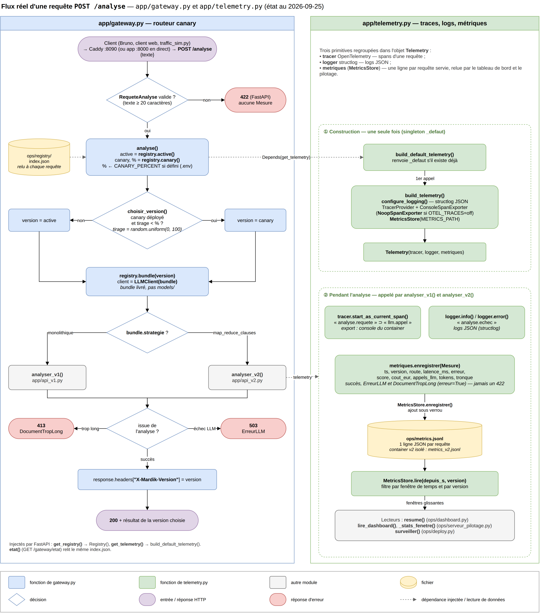

# Lire le schéma de flux gateway / telemetry

Ce guide accompagne le schéma
[flux-gateway-telemetry_reel.drawio](img/flux-gateway-telemetry_reel.drawio)
(export : [flux-gateway-telemetry_reel.png](img/flux-gateway-telemetry_reel.png)).
Il suffit de le lire une fois pour savoir comment parcourir le schéma.

## Ce que montre le schéma

Le trajet d'**une** requête `POST /analyse`, de son arrivée à la réponse, et
ce qui est enregistré au passage pour le tableau de bord et le pilotage.

Le suffixe `_reel` signifie que le schéma décrit le **code tel qu'il est**,
pas une cible de conception.

## Le code couleur

| Forme | Signification |
| --- | --- |
| Rectangle bleu | fonction de `app/gateway.py` |
| Rectangle vert | fonction de `app/telemetry.py` |
| Rectangle gris | fonction d'un autre module (`api_v1.py`, `api_v2.py`, lecteurs des métriques) |
| Losange | décision : chaque sortie porte sa condition (`oui`, `non`, `succès`…) |
| Cylindre jaune | fichier sur disque (`index.json`, `metrics.jsonl`) |
| Ovale violet | entrée de la requête, ou réponse `200` |
| Ovale rouge | réponse d'erreur (`422`, `413`, `503`) |
| Flèche pleine | enchaînement du flux |
| Flèche pointillée | dépendance injectée ou lecture d'un fichier |

## Le lire en trois temps

1. **Colonne de gauche, de haut en bas** : le parcours de la requête dans la
   gateway. Validation, lecture de l'état du canary, choix de la version,
   appel de la bonne analyse, puis réponse.
2. **Colonne de droite, bloc ①** : la construction de la télémétrie. Elle ne
   se fait **qu'une fois**, au premier appel, puis l'objet `Telemetry` est
   réutilisé.
3. **Colonne de droite, bloc ②** : ce qui se passe **à chaque analyse**. Les
   traces, les logs, et surtout une ligne ajoutée dans `ops/metrics.jsonl`,
   que relisent ensuite le tableau de bord et le pilotage.

Les deux flèches pointillées qui traversent d'une colonne à l'autre font le
lien : la gateway obtient la télémétrie par `Depends(get_telemetry)`, puis la
passe à `analyser_v1()` ou `analyser_v2()`.

## Les numéros de ligne

Chaque fonction porte, en brun, la ligne de son `def` ou de son `class` :

- `l.70` : ligne dans le fichier de la colonne (`gateway.py` ou `telemetry.py`) ;
- `api_v2.py:114` : ligne dans un autre fichier ;
- `registry:124` : ligne dans `ops/registry/__init__.py` ;
- pas de numéro : appel d'une bibliothèque (OpenTelemetry, structlog).

Pour y aller dans VS Code : ouvrir le fichier, puis `Ctrl+G` et le numéro.

Les numéros datent du 2026-09-25. Toute ligne ajoutée plus haut dans un
fichier les décale : en cas de doute, c'est le code qui fait foi.

## Un exemple : suivre une requête pendant un canary

Situation : v1 active, canary v2 déployé à 20 %.

1. Le texte fait plus de 20 caractères : `RequeteAnalyse` l'accepte.
2. `analyse()` relit `index.json` : active `v1.0.0`, canary à 20 %.
3. `choisir_version()` tire un nombre entre 0 et 100, par exemple 12 :
   12 < 20, donc la requête part vers le canary.
4. Le bundle du canary a la stratégie `map_reduce_clauses` : c'est
   `analyser_v2()` qui travaille.
5. Pendant l'analyse, une `Mesure` est ajoutée à `ops/metrics.jsonl`.
6. La réponse `200` porte l'en-tête `X-Mardik-Version` avec la version du
   canary.

Avec un tirage à 57, la même requête serait partie vers v1 (`analyser_v1()`).

## Trois questions auxquelles le schéma répond

### Pourquoi un rollback marche-t-il sans redémarrage ?

Parce que `analyse()` relit `index.json` à **chaque** requête (cylindre
jaune, en haut à gauche).

### Pourquoi un texte trop court ne compte-t-il pas dans le taux d'erreur ?

Parce qu'il est refusé en `422` par `RequeteAnalyse`, **avant** toute
analyse : aucune `Mesure` n'est écrite. Seuls les échecs du LLM et les
documents trop longs produisent une mesure `erreur=True` (bloc ②).

### Où le tableau de bord prend-il ses chiffres ?

Dans `ops/metrics.jsonl`, via `MetricsStore.lire()`, sur une fenêtre de
temps récente (en bas à droite).
